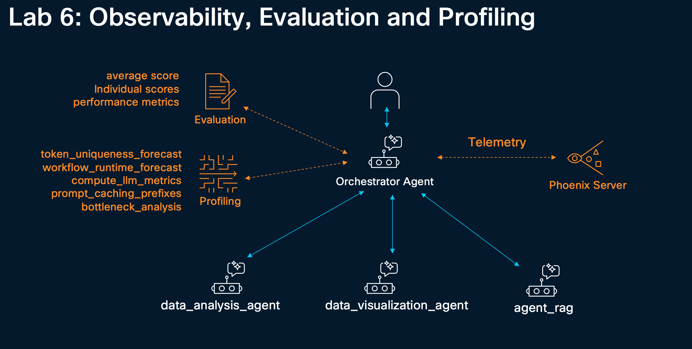
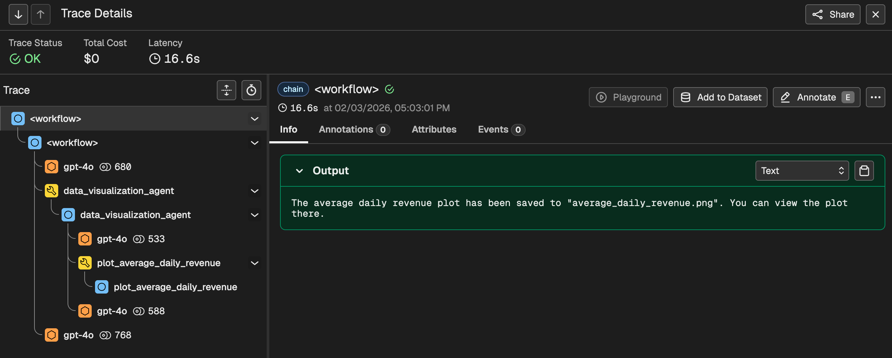
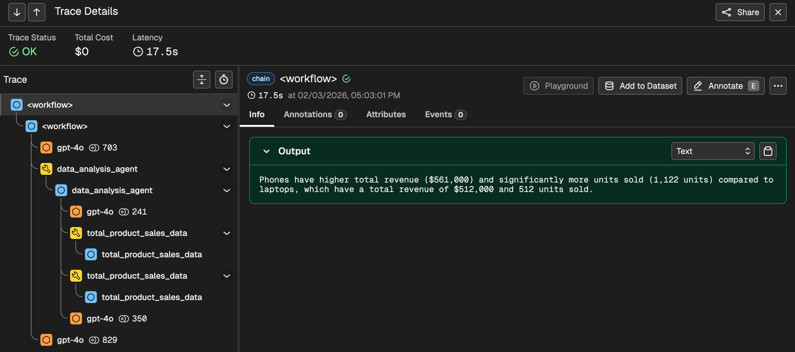
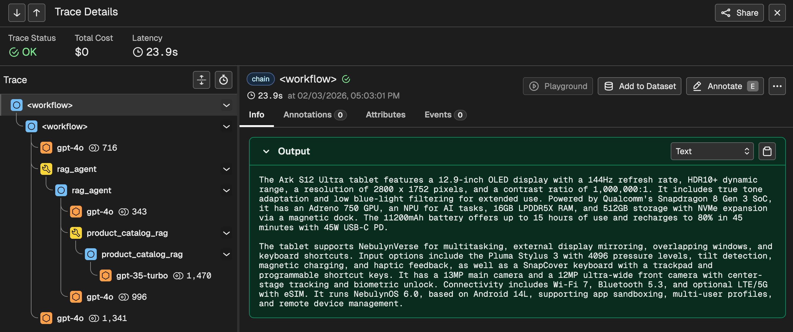
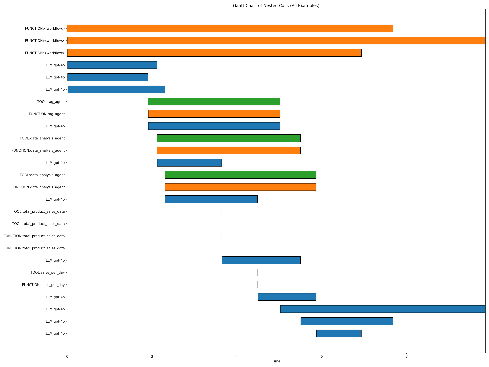

# 6. Tracing, Evaluating, and Profiling your Agent



In this lab, we will walk through the advanced capabilities of NVIDIA NeMo Agent toolkit (NAT) for <a href="https://docs.nvidia.com/nemo/agent-toolkit/latest/workflows/observe/index.html"> observability</a>, <a href="https://docs.nvidia.com/nemo/agent-toolkit/latest/workflows/evaluate.html">evaluation</a>, and <a href="https://docs.nvidia.com/nemo/agent-toolkit/latest/workflows/profiler.html">profiling</a>, from setting up Phoenix tracing to running comprehensive workflow assessments and performance analysis.

## 6.1 Register the required tools

```bash
cd ~/nemo-agent-toolkit/
cat > retail_sales_agent/src/retail_sales_agent/register.py <<'EOF'

from . import sales_per_day_tool
from . import detect_outliers_tool
from . import total_product_sales_data_tool
from . import llama_index_rag_tool
from . import data_visualization_tools
EOF
```

## 6.2 Workflow Configuration File

The following step creates a basic workflow configuration file:

```bash
cd ~/nemo-agent-toolkit/
cat > retail_sales_agent/configs/config_multi_agent.yml <<'EOF'
llms:
  azure_llm:
    _type: azure_openai
    azure_endpoint: ${AZURE_OPENAI_ENDPOINT}
    azure_deployment: ${AZURE_OPENAI_DEPLOYMENT}
    api_key: ${AZURE_OPENAI_API_KEY}
    api_version: ${AZURE_OPENAI_API_VERSION}
    temperature: 0.0

embedders:
  azure_embedder:
    _type: azure_openai
    azure_endpoint: ${AZURE_OPENAI_ENDPOINT}
    azure_deployment: ${AZURE_OPENAI_EMBEDDING_DEPLOYMENT}
    api_key: ${AZURE_OPENAI_API_KEY}
    api_version: ${AZURE_OPENAI_API_VERSION}
    truncate: END

functions:
  total_product_sales_data:
    _type: get_total_product_sales_data
    data_path: data/retail_sales_data.csv
  sales_per_day:
    _type: get_sales_per_day
    data_path: data/retail_sales_data.csv
  detect_outliers:
    _type: detect_outliers_iqr
    data_path: data/retail_sales_data.csv

  data_analysis_agent:
    _type: tool_calling_agent
    tool_names:
      - total_product_sales_data
      - sales_per_day
      - detect_outliers
    llm_name: azure_llm
    max_history: 10
    max_iterations: 15
    description: |
      A helpful assistant that can answer questions about the retail sales CSV data.
      Use the tools to answer the questions.
      Input is a single string.
    verbose: false

  product_catalog_rag:
    _type: llama_index_rag
    llm_name: azure_llm
    embedder_name: azure_embedder
    collection_name: product_catalog_rag
    data_dir: data/rag/
    description: "Search product catalog for Ark S12 Ultra tablet, TabZen tablet, AeroBook laptop and NovaPhone phone specifications"

  rag_agent:
    _type: react_agent
    llm_name: azure_llm
    tool_names: [product_catalog_rag]
    max_history: 3
    max_iterations: 5
    max_retries: 2
    description: |
      An assistant that can only answer questions about products.
      Use the product_catalog_rag tool to answer questions about products.
      Do not make up any information.
    verbose: false

  plot_sales_trend_for_stores:
    _type: plot_sales_trend_for_stores
    data_path: data/retail_sales_data.csv
  plot_and_compare_revenue_across_stores:
    _type: plot_and_compare_revenue_across_stores
    data_path: data/retail_sales_data.csv
  plot_average_daily_revenue:
    _type: plot_average_daily_revenue
    data_path: data/retail_sales_data.csv

  data_visualization_agent:
    _type: react_agent
    llm_name: azure_llm
    tool_names:
      - plot_sales_trend_for_stores
      - plot_and_compare_revenue_across_stores
      - plot_average_daily_revenue
    max_history: 10
    max_iterations: 15
    description: |
      You are a data visualization expert.
      You can only create plots and visualizations based on user requests.
      Only use available tools to generate plots.
      You cannot analyze any data.
    verbose: false
    handle_parsing_errors: true
    max_retries: 2
    retry_parsing_errors: true

workflow:
  _type: react_agent
  tool_names: [data_analysis_agent, data_visualization_agent, rag_agent]
  llm_name: azure_llm
  verbose: true
  handle_parsing_errors: true
  max_retries: 2
  system_prompt: |
    Answer the following questions as best you can.
    You may communicate and collaborate with various experts to answer the questions.

    {tools}

    You may respond in one of two formats.
    Use the following format exactly to communicate with an expert:

    Question: the input question you must answer
    Thought: you should always think about what to do
    Action: the action to take, should be one of [{tool_names}]
    Action Input: the input to the action (if there is no required input, include "Action Input: None")
    Observation: wait for the expert to respond, do not assume the expert's response

    ... (this Thought/Action/Action Input/Observation can repeat N times.)
    Use the following format once you have the final answer:

    Thought: I now know the final answer
    Final Answer: the final answer to the original input question
EOF
```

## 6.3 Run the workflow

```bash
cd ~/nemo-agent-toolkit/
nat run --config_file retail_sales_agent/configs/config_multi_agent.yml \
  --input "What is the Ark S12 Ultra tablet and what are its specifications?" \
  --input "How do laptop sales compare to phone sales?" \
  --input "Plot average daily revenue"
```


## 6.4 Observing a Workflow with Phoenix

Phoenix is an open-source observability platform designed for monitoring, debugging, and improving LLM applications and AI agents. It provides a web-based interface for visualizing and analyzing traces from LLM applications, agent workflows, and ML pipelines. Phoenix automatically captures key metrics such as latency, token usage, and costs, and displays the inputs and outputs at each step, making it invaluable for debugging complex agent behaviors and identifying performance bottlenecks in AI workflows.

### 6.4.1 Updating the Workflow Configuration For Telemetry

The NeMo Agent toolkit uses a flexible, plugin-based observability system that provides comprehensive support for configuring logging, tracing, and metrics for workflows.
These features enable developers to test their workflows locally and integrate observability seamlessly with their preferred monitoring stack.

We will need to update the workflow configuration file to support telemetry tracing with Phoenix.

To do this, we will first copy the original configuration:

```bash
cd ~/nemo-agent-toolkit/
cp retail_sales_agent/configs/config_multi_agent.yml retail_sales_agent/configs/phoenix_config.yml
```

Then we will append necessary configuration components to the `phoenix_config.yml` file:

```bash
cd ~/nemo-agent-toolkit/
cat >> retail_sales_agent/configs/phoenix_config.yml <<'EOF'

general:
  telemetry:
    logging:
      console:
        _type: console
        level: WARN
    tracing:
      phoenix:
        _type: phoenix
        endpoint: http://localhost:6006/v1/traces
        project: retail_sales_agent
EOF
```

The observability system is configured using the `general.telemetry` section in the workflow configuration file. This section contains two subsections: `logging` and `tracing`, and each subsection can contain multiple telemetry exporters running simultaneously.

The `logging` section contains one or more logging providers. Each provider has a `_type` and optional configuration fields. The following logging providers are supported by default:

- **`console`**: Writes logs to the console.
- **`file`**: Writes logs to a file.

Available log levels:

- **`DEBUG`**: Detailed information for debugging.
- **`INFO`**: General information about the workflow.
- **`WARNING`**: Potential issues that should be addressed.
- **`ERROR`**: Issues that affect the workflow from running correctly.
- **`CRITICAL`**: Severe issues that prevent the workflow from continuing to run.

This setup enables tracing through Phoenix at http://localhost:6006/v1/traces, with traces grouped into the `retail_sales_agent` project.


### 6.4.2 Install Phoenix telemetry plugin

```bash
uv pip install -e packages/nvidia_nat_phoenix
```

### 6.4.3 Start Phoenix Server

```bash
uv pip install arize-phoenix
export PHOENIX_HOST=0.0.0.0
phoenix serve &
```

Wait for the server to become operational, you should have a similar output:

```console
✅ Migrations completed in 0.502 seconds.
INFO:     Started server process [9256]
INFO:     Waiting for application startup.


██████╗ ██╗  ██╗ ██████╗ ███████╗███╗   ██╗██╗██╗  ██╗
██╔══██╗██║  ██║██╔═══██╗██╔════╝████╗  ██║██║╚██╗██╔╝
██████╔╝███████║██║   ██║█████╗  ██╔██╗ ██║██║ ╚███╔╝
██╔═══╝ ██╔══██║██║   ██║██╔══╝  ██║╚██╗██║██║ ██╔██╗
██║     ██║  ██║╚██████╔╝███████╗██║ ╚████║██║██╔╝ ██╗
╚═╝     ╚═╝  ╚═╝ ╚═════╝ ╚══════╝╚═╝  ╚═══╝╚═╝╚═╝  ╚═╝ v12.35.0

|  ⭐️⭐️⭐️ Support Open Source ⭐️⭐️⭐️
|  ⭐️⭐️⭐️ Star on GitHub! ⭐️⭐️⭐️
|  https://github.com/Arize-ai/phoenix
|
|  🌎 Join our Community 🌎
|  https://arize-ai.slack.com/join/shared_invite/zt-2w57bhem8-hq24MB6u7yE_ZF_ilOYSBw#/shared-invite/email
|
|  📚 Documentation 📚
|  https://arize.com/docs/phoenix
|
|  🚀 Phoenix Server 🚀
|  Phoenix UI: http://localhost:6006
|
|  Authentication: False
|  Log traces:
|    - gRPC: http://localhost:4317
|    - HTTP: http://localhost:6006/v1/traces
|  Storage: sqlite:////home/ubuntu/.phoenix/phoenix.db
INFO:     Application startup complete.
INFO:     Uvicorn running on http://0.0.0.0:6006 (Press CTRL+C to quit)
```

### 6.4.4 Rerun the Workflow

Open a second terminal to rerun the workflow

<a href="#"  onclick="showLabPanel(1,1); return false;" style="font-size:1.25em; background:#007cba; color:#fff; padding:10px 20px; border-radius:6px; text-decoration:none;">
  Open New Terminal
</a>   

Instead of the original workflow configuration, we will run with the updated `phoenix_config.yml` file:

```bash
cd ~/nemo-agent-toolkit/
source .venv/bin/activate
nat run --config_file retail_sales_agent/configs/phoenix_config.yml \
  --input "What is the Ark S12 Ultra tablet and what are its specifications?" \
  --input "How do laptop sales compare to phone sales?" \
  --input "Plot average daily revenue"
```

### 6.4.5 Viewing the trace

You can access the Phoenix server at [Phoenix Server Access Link](https://%%LABURL%%:6100)

Locate your workflow traces under your project name in projects.

Inspect function execution details, latency, total tokens, request timelines and other info under `Info` and `Attributes` tab of an individual trace.

You should visualize the following traces for the three tools access:

- Data Visualization Agent:



You can see that the NeMo Agent Toolkit instruments **both** the orchestration and the execution span:

```console
<workflow>
 └─ data_visualization_agent        ← agent orchestration span
     └─ data_visualization_agent    ← agent execution span
```

1. **The agent wrapper** (orchestration)
    - lifecycle
    - planning loop
    - retries
    - tool selection logic
    
2. **The agent “run” itself** (execution)
    - actual reasoning iterations
    - LLM calls
    - tool calls

The orchestration span means "I am invoking this agent as part of the workflow" and it survives even if the inner execution retries or fails, when the execution span means "This is the concrete execution of that agent" and that inner span can be repeated without breaking workflow structure.


- Data Analysis Agent:



Inside one data_analysis_agent, you see two inner blocks that look like this:

```console
total_product_sales_data
 └─ total_product_sales_data
```

And that whole structure appears twice under the same agent.

To produce that sentence "Phones have higher total revenue … compared to laptops…", the agent needs two independent facts:

•	total sales for phones   
•	total sales for laptops  

Most ReAct-style agents do not batch these by default.
Instead, they do something like:

```console
Thought: I need total sales for phones
Action: total_product_sales_data(product="phones")

Thought: I need total sales for laptops
Action: total_product_sales_data(product="laptops")
```

The trace clearly highlights that the same tool is used but with different inputs for the two separate reasoning steps required.

- RAG Agent:




From the above trace, note the use of gpt-35-turbo in the `product_catalog_rag` execution span. This is very important as this model is used to:   
	•	summarize retrieved chunks.  
	•	deduplicate overlapping content.  
	•	compress context to fit token limits.  

In other words it turns raw catalog chunks into clean, usable context.

That’s why:   
	•	it uses a cheaper model.   
	•	token count is higher.  
	•	it sits inside the retrieval tool.  

This is a best practice RAG pattern.

## 6.5 Evaluating a Workflow

Evaluation is the process of executing workflows (agents, tools, or pipelines) on curated test data and measuring their quality using quantitative metrics such as accuracy, reliability, and latency. Each of these metrics in turn is produced by an evaluator.  
After setting up observability, the next step is to evaluate your workflow's performance against a test dataset. NAT provides a powerful evaluation framework that can assess your agent's responses using various metrics and evaluators. 

For detailed information on evaluation, please refer to the [Evaluating NVIDIA NeMo Agent Toolkit Workflows](https://docs.nvidia.com/nemo/agent-toolkit/latest/workflows/evaluate.html).

### 6.5.1 Create an Evaluation Dataset

For evaluating this workflow, we will created a sample dataset.

The dataset will contain three test cases covering different query types. Each entry contains a question and the expected answer that the agent should provide.

```bash
cd ~/nemo-agent-toolkit/
cat > retail_sales_agent/data/eval_data.json <<'EOF'
[
    {
        "id": "1",
        "question": "How do laptop sales compare to phone sales?",
        "answer": "Phone sales are higher than laptop sales in terms of both revenue and units sold. Phones generated a revenue of 561,000 with 1,122 units sold, whereas laptops generated a revenue of 512,000 with 512 units sold."
    },
    {
        "id": "2",
        "question": "What is the Ark S12 Ultra tablet and what are its specifications?",
        "answer": "The Ark S12 Ultra Ultra tablet features a 12.9-inch OLED display with a 144Hz refresh rate, HDR10+ dynamic range, and a resolution of 2800 x 1752 pixels. It has a contrast ratio of 1,000,000:1. The device is powered by Qualcomm's Snapdragon 8 Gen 3 SoC, which includes an Adreno 750 GPU and an NPU for on-device AI tasks. It comes with 16GB LPDDR5X RAM and 512GB of storage, with support for NVMe expansion via a proprietary magnetic dock. The tablet has a 11200mAh battery that enables up to 15 hours of typical use and recharges to 80 percent in 45 minutes via 45W USB-C PD. Additionally, it features a 13MP main sensor and a 12MP ultra-wide front camera, microphone arrays with beamforming, Wi-Fi 7, Bluetooth 5.3, and optional LTE/5G with eSIM. The device runs NebulynOS 6.0, based on Android 14L, and supports app sandboxing, multi-user profiles, and remote device management. It also includes the Pluma Stylus 3 with magnetic charging, 4096 pressure levels, and tilt detection, as well as a SnapCover keyboard with a trackpad and programmable shortcut keys."
    },
    {
        "id": "3",
        "question": "What were the laptop sales on Feb 16th 2024?",
        "answer": "On February 16th, 2024, the total laptop sales were 13 units, generating a total revenue of $13,000."
    }
]
EOF
```

### 6.5.2 Updating the Workflow Configuration

Workflow configuration files can contain extra settings relevant for evaluation and profiling.

To do this, we will first copy the original configuration:

```bash
cd ~/nemo-agent-toolkit/
cp retail_sales_agent/configs/config_multi_agent.yml retail_sales_agent/configs/config_eval.yml
```

Then, we will append necessary configuration components to the `config_eval.yml` file:

```bash
cd ~/nemo-agent-toolkit/
cat >> retail_sales_agent/configs/config_eval.yml <<'EOF'

eval:
  general:
    output_dir: ./eval_output
    verbose: true
    dataset:
        _type: json
        file_path: ./retail_sales_agent/data/eval_data.json

  evaluators:
    accuracy:
      _type: ragas
      metric: AnswerAccuracy
      llm_name: azure_llm
    groundedness:
      _type: ragas
      metric: ResponseGroundedness
      llm_name: azure_llm
    relevance:
      _type: ragas
      metric: ContextRelevance
      llm_name: azure_llm
    trajectory_accuracy:
      _type: trajectory
      llm_name: azure_llm
EOF
```

The evaluators section of the config file specifies the evaluators to use for evaluating the workflow output. The evaluator configuration includes the evaluator type, the metric to evaluate, and any additional parameters required by the evaluator.
We use [RAGAS](https://docs.ragas.io/), an open-source evaluation framework that enables end-to-end evaluation of LLM workflows. NeMo Agent toolkit provides an evaluation interface to interact with Ragas.  

The following ragas metrics are recommended for RAG workflows:

- **`AnswerAccuracy`**: Evaluates the accuracy of the answer generated by the workflow against the expected answer or ground truth.  

Question it answers: Is the final answer correct with respect to the expected outcome?   
	•	Compares the model’s final response against a reference answer, label, or known ground truth.   
	•	Focuses on task success, not how the answer was produced.  
	•	A response can be accurate even if the model hallucinated internally or ignored the provided context.    

- **`ContextRelevance`**: Evaluates the relevance of the context retrieved by the workflow against the question.   

Question it answers: Was the retrieved/provided context actually useful for the question?   
	•	Evaluates how well the context fed to the agent aligns with the user query.   
	•	Commonly used in RAG pipelines to assess retrieval quality.   
	•	Independent of whether the final answer is correct.   

- **`ResponseGroundedness`**: Evaluates the groundedness of the response generated by the workflow based on the context retrieved by the workflow.  

Question it answers: Is the answer supported by the provided context?    
	•	Measures whether claims in the response are explicitly grounded in the supplied context.   
	•	Penalizes hallucinations and unsupported reasoning.   
	•	Critical for trust, compliance, and explainability.   

In NeMo Agent Toolkit, these three metrics look similar on the surface, but they answer different questions at different layers of the agent pipeline. Think of them as answer quality, retrieval quality, and faithfulness—orthogonal, not redundant.

These metrics use a judge LLM for evaluating the generated output and retrieved context. The judge LLM is configured in the llms section of the configuration file and is referenced by the llm_name key in the evaluator configuration.


- the **`trajectory`** evaluator uses the intermediate steps generated by the workflow to evaluate the workflow trajectory. 

Trajectory evaluation looks at the entire path an agent takes—not just the final answer. It evaluates whether the agent’s sequence of thoughts → tool calls → observations → decisions → answer makes sense, stays aligned with the goal, and uses tools/context correctly.

An agent can be accurate, relevant, and grounded, yet still have a bad trajectory (inefficient, fragile, unsafe).  

The evaluator configuration includes the evaluator type and any additional parameters required by the evaluator. A judge LLM is used to evaluate the trajectory produced by the workflow, taking into account the tools available during execution.

### 6.5.3 Running the Evaluation

The `nat eval` command executes the workflow against all entries in the dataset and evaluates the results using configured evaluators. Run the cell below to evaluate the retail sales agent workflow.

```bash
cd ~/nemo-agent-toolkit/
nat eval --config_file retail_sales_agent/configs/config_eval.yml
```

### 6.5.4 Understanding Evaluation Results

The `nat eval` command runs the workflow on all entries in the dataset and produces several output files:   

- **`workflow_output.json`**: Contains the raw outputs from the workflow for each input in the dataset.  
- **Evaluator-specific files**: Each configured evaluator generates its own output file with scores and reasoning.  

Each evaluator provides:   
- An **average score** across all dataset entries (0-1 scale, where 1 is perfect).  
- **Individual scores** for each entry with detailed reasoning.  
- **Performance metrics** to help identify areas for improvement.  

All evaluation results are stored in the `output_dir` specified in the configuration file.

Let's check the results for the **`AnswerAccuracy`**

```bash
cat eval_output/accuracy_output.json | jq '{average_score, eval_output_items: [.eval_output_items[2]]}'
```

You should have a similar output:

```json
{
  "average_score": 0.8333333333333334,
  "eval_output_items": [
    {
      "id": 3,
      "score": 1,
      "reasoning": {
        "user_input": "What were the laptop sales on Feb 16th 2024?",
        "reference": "On February 16th, 2024, the total laptop sales were 13 units, generating a total revenue of $13,000.",
        "response": "On February 16th, 2024, the total laptop sales amounted to 13 units, generating a revenue of $13,000.",
        "retrieved_contexts": [
          "**Step 0**\nThought: To answer this question, I need to analyze the retail sales data for laptop sales on February 16th, 2024.\n\nAction: data_analysis_agent\nAction Input: {\"input_message\": \"What were the laptop sales on Feb 16th 2024?\"}",
          "**Step 1**\n\n\nTool calls: [{'id': 'call_h3EZN8smDzgMafYmVl9p4BEt', 'function': {'arguments': '{\"date\":\"2024-02-16\",\"product\":\"laptop\"}', 'name': 'sales_per_day'}, 'type': 'function'}]",
          "**Step 2**\n{'content': 'Total revenue for 2024-02-16 is 13000 and total units sold is 13', 'additional_kwargs': {}, 'response_metadata': {}, 'type': 'tool', 'name': 'sales_per_day', 'id': None, 'tool_call_id': 'call_h3EZN8smDzgMafYmVl9p4BEt', 'artifact': None, 'status': 'success'}",
          "**Step 3**\nOn February 16th, 2024, the total laptop sales amounted to 13 units, generating a revenue of $13,000.",
          "**Step 4**\nOn February 16th, 2024, the total laptop sales amounted to 13 units, generating a revenue of $13,000.",
          "**Step 5**\nThought: I now know the final answer.\n\nFinal Answer: On February 16th, 2024, the total laptop sales amounted to 13 units, generating a revenue of $13,000."
        ]
      }
    }
  ]
}
```

Let's check the results for the **`ContextRelevance`**

```bash
cat eval_output/relevance_output.json | jq '{average_score, eval_output_items: [.eval_output_items[1]]}'
```

You should have a similar output:

```json
{
  "average_score": 1,
  "eval_output_items": [
    {
      "id": 2,
      "score": 1,
      "reasoning": {
        "user_input": "What is the Ark S12 Ultra tablet and what are its specifications?",
        "reference": "The Ark S12 Ultra Ultra tablet features a 12.9-inch OLED display with a 144Hz refresh rate, HDR10+ dynamic range, and a resolution of 2800 x 1752 pixels. It has a contrast ratio of 1,000,000:1. The device is powered by Qualcomm's Snapdragon 8 Gen 3 SoC, which includes an Adreno 750 GPU and an NPU for on-device AI tasks. It comes with 16GB LPDDR5X RAM and 512GB of storage, with support for NVMe expansion via a proprietary magnetic dock. The tablet has a 11200mAh battery that enables up to 15 hours of typical use and recharges to 80 percent in 45 minutes via 45W USB-C PD. Additionally, it features a 13MP main sensor and a 12MP ultra-wide front camera, microphone arrays with beamforming, Wi-Fi 7, Bluetooth 5.3, and optional LTE/5G with eSIM. The device runs NebulynOS 6.0, based on Android 14L, and supports app sandboxing, multi-user profiles, and remote device management. It also includes the Pluma Stylus 3 with magnetic charging, 4096 pressure levels, and tilt detection, as well as a SnapCover keyboard with a trackpad and programmable shortcut keys.",
        "response": "The Ark S12 Ultra tablet features a 12.9-inch OLED display with a 144Hz refresh rate, HDR10+ dynamic range, and a resolution of 2800 x 1752 pixels. It is powered by Qualcomm's Snapdragon 8 Gen 3 SoC, 16GB LPDDR5X RAM, and 512GB storage with NVMe expansion support. It has a 11200mAh battery with fast charging, supports multitasking with NebulynVerse, and includes accessories like the Pluma Stylus 3 and SnapCover keyboard. It runs on NebulynOS 6.0 based on Android 14L and offers advanced connectivity options like Wi-Fi 7, Bluetooth 5.3, and optional LTE/5G.",
        "retrieved_contexts": [
          "**Step 0**\nQuestion: What is the Ark S12 Ultra tablet and what are its specifications?\nThought: I should use the product catalog to find information about the Ark S12 Ultra tablet and its specifications.\nAction: rag_agent\nAction Input: {\"input_message\": \"What is the Ark S12 Ultra tablet and what are its specifications?\"}",
          "**Step 1**\nThought: I need to find the specifications of the Ark S12 Ultra tablet to answer the question accurately.\nAction: product_catalog_rag\nAction Input: {\"inputs\": \"Ark S12 Ultra tablet specifications\"}",
          ...
          "**Step 6**\nThought: I now know the final answer.\nFinal Answer: The Ark S12 Ultra tablet features a 12.9-inch OLED display with a 144Hz refresh rate, HDR10+ dynamic range, and a resolution of 2800 x 1752 pixels. It is powered by Qualcomm's Snapdragon 8 Gen 3 SoC, 16GB LPDDR5X RAM, and 512GB storage with NVMe expansion support. It has a 11200mAh battery with fast charging, supports multitasking with NebulynVerse, and includes accessories like the Pluma Stylus 3 and SnapCover keyboard. It runs on NebulynOS 6.0 based on Android 14L and offers advanced connectivity options like Wi-Fi 7, Bluetooth 5.3, and optional LTE/5G."
        ]
      }
    }
  ]
}
```

Let's check the results for the **`ResponseGroundedness`**

```bash
cat eval_output/groundedness_output.json | jq '{average_score, eval_output_items: [.eval_output_items[0]]}'
```

You should have a similar output:

```json
{
  "average_score": 1,
  "eval_output_items": [
    {
      "id": 1,
      "score": 1,
      "reasoning": {
        "user_input": "How do laptop sales compare to phone sales?",
        "reference": "Phone sales are higher than laptop sales in terms of both revenue and units sold. Phones generated a revenue of 561,000 with 1,122 units sold, whereas laptops generated a revenue of 512,000 with 512 units sold.",
        "response": "Phones have higher total revenue ($561,000) and significantly more units sold (1,122 units) compared to laptops, which have a total revenue of $512,000 and 512 units sold.",
        "retrieved_contexts": [
          "**Step 0**\nThought: To answer this question, I need to analyze the sales data for laptops and phones. I will consult the data analysis agent to compare the sales of these two product categories.\n\nAction: data_analysis_agent\nAction Input: {\"input_message\": \"Compare laptop sales to phone sales in the dataset.\"}",
          "**Step 1**\n\n\nTool calls: [{'id': 'call_eDOb1G4GOryydXlccfI6cEQB', 'function': {'arguments': '{\"product_name\": \"laptop\"}', 'name': 'total_product_sales_data'}, 'type': 'function'}, {'id': 'call_a2w6nfMtgk6u0cFiWKLmsC5D', 'function': {'arguments': '{\"product_name\": \"phone\"}', 'name': 'total_product_sales_data'}, 'type': 'function'}]",
          "**Step 2**\n{'content': 'Revenue for laptop are 512000 and total units sold are 512', 'additional_kwargs': {}, 'response_metadata': {}, 'type': 'tool', 'name': 'total_product_sales_data', 'id': None, 'tool_call_id': 'call_eDOb1G4GOryydXlccfI6cEQB', 'artifact': None, 'status': 'success'}",
          "**Step 3**\n{'content': 'Revenue for phone are 561000 and total units sold are 1122', 'additional_kwargs': {}, 'response_metadata': {}, 'type': 'tool', 'name': 'total_product_sales_data', 'id': None, 'tool_call_id': 'call_a2w6nfMtgk6u0cFiWKLmsC5D', 'artifact': None, 'status': 'success'}",
          "**Step 4**\nThe comparison of sales between laptops and phones is as follows:\n\n- **Laptops**: Total revenue is $512,000 with 512 units sold.\n- **Phones**: Total revenue is $561,000 with 1,122 units sold.\n\nPhones have higher total revenue and significantly more units sold compared to laptops.",
          "**Step 5**\nThe comparison of sales between laptops and phones is as follows:\n\n- **Laptops**: Total revenue is $512,000 with 512 units sold.\n- **Phones**: Total revenue is $561,000 with 1,122 units sold.\n\nPhones have higher total revenue and significantly more units sold compared to laptops.",
          "**Step 6**\nThought: I now know the final answer.\n\nFinal Answer: Phones have higher total revenue ($561,000) and significantly more units sold (1,122 units) compared to laptops, which have a total revenue of $512,000 and 512 units sold."
        ]
      }
    }
  ]
}
```

Let's check the results for the **`trajectory`**

```bash
cd ~/nemo-agent-toolkit/
cat eval_output/trajectory_accuracy_output.json | jq '{
  average_score,
  eval_output_items: [
    (.eval_output_items[0]
     | del(.reasoning.trajectory))
  ]
}'
```

You should have the following output:

```json
{
  "average_score": 0.92,
  "eval_output_items": [
    {
      "id": 1,
      "score": 0.75,
      "reasoning": {
        "reasoning": "### Evaluation of the AI language model's answer:\n\n#### i. Is the final answer helpful?\nThe final answer is helpful. It provides a clear comparison between laptop and phone sales, including both revenue and units sold. The information is relevant and directly addresses the user's question.\n\n**Score for this criterion: 5**\n\n---\n\n#### ii. Does the AI language use a logical sequence of tools to answer the question?\nThe AI uses a logical sequence of tools to retrieve and analyze the sales data for laptops and phones. It first queries the sales data for laptops and phones separately, then compares the results and provides the final answer. The sequence is logical and follows a clear progression.\n\n**Score for this criterion: 5**\n\n---\n\n#### iii. Does the AI language model use the tools in a helpful way?\nThe tools are used effectively to retrieve the necessary data. The AI correctly queries the sales data for laptops and phones and uses the information to generate a meaningful comparison. However, there is some redundancy in the tool usage (e.g., Step 6 repeats the comparison already made in Step 5). While this does not detract from the accuracy of the answer, it indicates inefficiency.\n\n**Score for this criterion: 4**\n\n---\n\n#### iv. Does the AI language model use too many steps to answer the question?\nThe AI uses seven steps to answer the question, which is excessive. Steps 5, 6, and 7 essentially repeat the same information, and Step 6 (data_analysis_agent) is redundant because the comparison was already made in Step 5. The AI could have streamlined the process by eliminating unnecessary steps.\n\n**Score for this criterion: 3**\n\n---\n\n#### v. Are the appropriate tools used to answer the question?\nThe appropriate tools are used to answer the question. The AI correctly uses the `total_product_sales_data` tool to retrieve sales data for laptops and phones, and it uses the analysis tools to compare the results. However, the repeated use of tools in Steps 5, 6, and 7 suggests inefficiency in tool selection and usage.\n\n**Score for this criterion: 4**\n\n---\n\n### Final Score:\n- **i. Is the final answer helpful?**: 5  \n- **ii. Does the AI language use a logical sequence of tools to answer the question?**: 5  \n- **iii. Does the AI language model use the tools in a helpful way?**: 4  \n- **iv. Does the AI language model use too many steps to answer the question?**: 3  \n- **v. Are the appropriate tools used to answer the question?**: 4  \n\n**Overall"
      }
    }
  ]
}
```

By cleaning the `reasoning` text result we have:

i. Is the final answer helpful?   
The final answer is helpful. It provides a clear comparison between laptop and phone sales, including both revenue and units sold. The information is relevant and directly addresses the user’s question.  

Score for this criterion: 5  

⸻  

ii. Does the AI language use a logical sequence of tools to answer the question?   
The AI uses a logical sequence of tools to retrieve and analyze the sales data for laptops and phones. It first queries the sales data for laptops and phones separately, then compares the results and provides the final answer. The sequence is logical and follows a clear progression.   

Score for this criterion: 5   

⸻

iii. Does the AI language model use the tools in a helpful way?   
The tools are used effectively to retrieve the necessary data. The AI correctly queries the sales data for laptops and phones and uses the information to generate a meaningful comparison. However, there is some redundancy in the tool usage (e.g., Step 6 repeats the comparison already made in Step 5). While this does not detract from the accuracy of the answer, it indicates inefficiency.   

Score for this criterion: 4  

⸻

iv. Does the AI language model use too many steps to answer the question?     
The AI uses seven steps to answer the question, which is excessive. Steps 5, 6, and 7 essentially repeat the same information, and Step 6 (data_analysis_agent) is redundant because the comparison was already made in Step 5. The AI could have streamlined the process by eliminating unnecessary steps.   

Score for this criterion: 3     

⸻

v. Are the appropriate tools used to answer the question?   
The appropriate tools are used to answer the question. The AI correctly uses the total_product_sales_data tool to retrieve sales data for laptops and phones and uses the analysis tools to compare the results. However, the repeated use of tools in Steps 5, 6, and 7 suggests inefficiency in tool selection and usage.   

Score for this criterion: 4   

⸻

Final Score Summary
	•	i. Is the final answer helpful?: 5   
	•	ii. Does the AI language use a logical sequence of tools to answer the question?: 5   
	•	iii. Does the AI language model use the tools in a helpful way?: 4   
	•	iv. Does the AI language model use too many steps to answer the question?: 3   
	•	v. Are the appropriate tools used to answer the question?: 4    


## 6.6 Profiling a Workflow

Profiling provides deep insights into your workflow's performance characteristics, helping you identify bottlenecks, optimize resource usage, and improve overall efficiency.

For detailed information on profiling, please refer to the [Profiling and Performance Monitoring of NVIDIA NeMo Agent Toolkit Workflows](https://docs.nvidia.com/nemo/agent-toolkit/latest/workflows/profiler.html).

### 6.6.1 Updating the Workflow Configuration

Workflow configuration files can contain extra settings relevant for evaluation and profiling.

To do this, we will first copy the original configuration:

```bash
cd ~/nemo-agent-toolkit/
cp retail_sales_agent/configs/config_multi_agent.yml retail_sales_agent/configs/config_profile.yml
```

Then, we will append necessary configuration components to the `config_profile.yml` file:

```bash
cd ~/nemo-agent-toolkit/
cat >> retail_sales_agent/configs/config_profile.yml <<'EOF'

eval:
  general:
    output_dir: ./profile_output
    verbose: true
    dataset:
        _type: json
        file_path: ./retail_sales_agent/data/eval_data.json

    profiler:
        token_uniqueness_forecast: true
        workflow_runtime_forecast: true
        compute_llm_metrics: true
        csv_exclude_io_text: true
        prompt_caching_prefixes:
          enable: true
          min_frequency: 0.1
        bottleneck_analysis:
          enable_nested_stack: true
        concurrency_spike_analysis:
          enable: true
          spike_threshold: 7
EOF
```

### 6.6.2 Understanding the Profiler Configuration

We will reuse the same configuration as evaluation.

The profiler is configured through the `profiler` section of your workflow configuration file. It runs alongside the `nat eval` command and offers several analysis options:

- **`token_uniqueness_forecast`**: Computes the inter-query token uniqueness forecast, predicting the expected number of unique tokens in the next query based on tokens used in previous queries

- **`workflow_runtime_forecast`**: Calculates the expected workflow runtime based on historical query performance

- **`compute_llm_metrics`**: Computes inference optimization metrics including latency, throughput, and other performance indicators

- **`csv_exclude_io_text`**: Prevents large text from being dumped into output CSV files, preserving CSV structure and readability

- **`prompt_caching_prefixes`**: Identifies common prompt prefixes that can be pre-populated in KV caches for improved performance

- **`bottleneck_analysis`**: Analyzes workflow performance measures such as bottlenecks, latency, and concurrency spikes
  - `simple_stack`: Provides a high-level analysis
  - `nested_stack`: Offers detailed analysis of nested bottlenecks (e.g., tool calls inside other tool calls)

- **`concurrency_spike_analysis`**: Identifies concurrency spikes in your workflow. The `spike_threshold` parameter (e.g., 7) determines when to flag spikes based on the number of concurrent running functions

The `output_dir` parameter specifies where all profiler outputs will be stored for later analysis.

### 6.6.3 Running the Profiler

The profiler runs as part of the `nat eval` command. When properly configured, it will collect performance data across all evaluation runs and generate comprehensive profiling reports.

```bash
cd ~/nemo-agent-toolkit/
nat eval --config_file retail_sales_agent/configs/config_profile.yml
cp ./profile_output/gantt_chart.png /var/www/html/lab/images/gantt_chart.png
```

### 6.6.4 Understanding Profiler Output Files

Based on the profiler configuration, the following files will be generated in the `output_dir`:

**Core Output Files:**

1. **`all_requests_profiler_traces.json`**: Raw usage statistics collected by the profiler, including:
   - Raw traces of LLM interactions
   - Tool input and output data
   - Runtime measurements
   - Execution metadata

2. **`inference_optimization.json`**: Workflow-specific performance metrics with confidence intervals:
   - 90%, 95%, and 99% confidence intervals for latency
   - Throughput statistics
   - Workflow runtime predictions

3. **`standardized_data_all.csv`**: Standardized usage data in CSV format containing:
   - Prompt tokens and completion tokens
   - LLM input/output
   - Framework information
   - Additional metadata

**Advanced Analysis Files**

4. **Analysis Reports**: JSON files and text reports for any advanced techniques enabled:
   - Concurrency analysis results
   - Bottleneck analysis reports
   - PrefixSpan pattern mining results

These files provide comprehensive insights into your workflow's performance and can be used for optimization and debugging.

**Gantt Chart**

We can also view a Gantt chart of the profile run:

<a href="#" onclick="showImagePopup({ 
src: 'lab/images/gantt_chart.png'}); return false;">
Open Gantt Chart
</a>

You should have a similar chart:




The profiling Gantt charts show that overall latency is dominated by repeated LLM inference phases, which form the critical path of the workflow, while tool executions themselves are relatively fast and inexpensive. The agent follows a logically correct ReAct-style sequence, but it revisits the same tools and reasoning steps multiple times, creating unnecessary orchestration and inference overhead. This confirms that the system is accurate and well-grounded, yet inefficient in its trajectory, with most optimization potential coming from reducing redundant LLM calls and collapsing repeated agent steps rather than from accelerating the tools.

## 6.7 Lab Summary

In this notebook, we covered the complete workflow for observability, evaluation, and profiling in NeMo Agent Toolkit:

**Observability with Phoenix**
- Configured tracing in the workflow configuration.  
- Started the Phoenix server for real-time monitoring.  
- Executed workflows with automatic trace capture.  
- Visualized agent execution flow and LLM interactions.  

**Evaluation with `nat eval`**
- Created a comprehensive evaluation dataset.  
- Ran automated evaluations across multiple test cases.  
- Reviewed evaluation metrics and scores.  
- Analyzed workflow performance against expected outputs.  

**Profiling for Performance Optimization**
- Configured advanced profiling options.  
- Collected performance metrics and usage statistics.  
- Generated detailed profiling reports.  
- Identified bottlenecks and optimization opportunities.  

These three pillars—observability, evaluation, and profiling—work together to provide a complete picture of your agent's behavior, accuracy, and performance, enabling you to build production-ready AI applications with confidence.   
