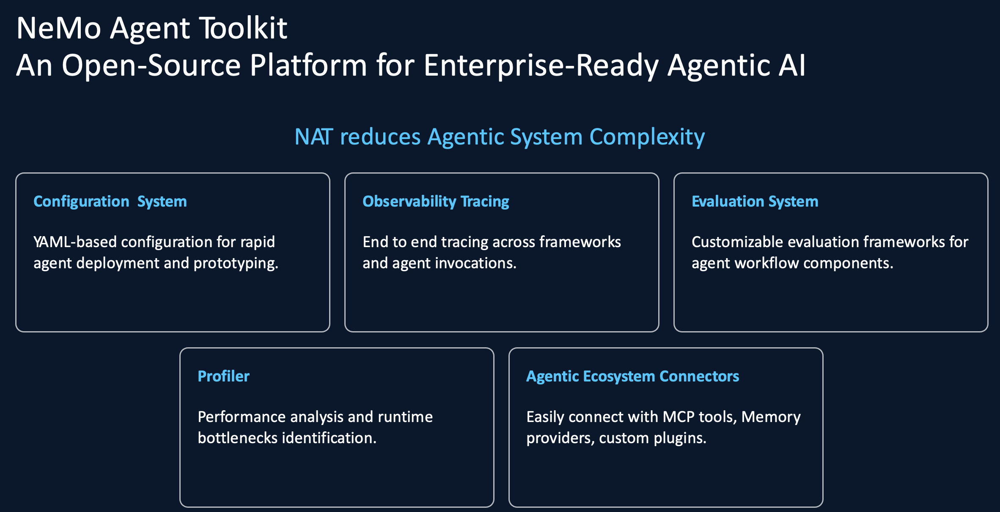

# NeMo Agent Toolkit (NAT) Labs Overview

This repo contains a hands-on lab series for NVIDIA NeMo Agent Toolkit (NAT). The labs build progressively from a first workflow, to tool calling, to retrieval (RAG), multi-agent orchestration, human-in-the-loop patterns, and finally observability/evaluation/profiling and MCP integration. It is based on NVIDIA documentation available at https://docs.nvidia.com/nemo/agent-toolkit/latest/index.html

## Prerequisites

**Runtime**
- Python environment with the lab repo checked out (these labs assume you can create/activate a virtualenv).
- `uv` installed (used throughout the labs for syncing and installing editable subpackages).

**LLM credentials (Azure OpenAI)**

Most labs use Azure OpenAI via environment variables referenced from YAML configs. Ensure these are set in your shell before running `nat run` / `nat eval`:

- `AZURE_OPENAI_ENDPOINT`
- `AZURE_OPENAI_API_KEY`
- `AZURE_OPENAI_API_VERSION`
- `AZURE_OPENAI_DEPLOYMENT` (chat/completions model deployment)
- `AZURE_OPENAI_EMBEDDING_DEPLOYMENT` (embedding model deployment; needed for RAG labs)
- `AZURE_OPENAI_VISION_DEPLOYMENT` (vision-capable deployment; used for the plot summarizer in the HITL lab)

**Optional (per-lab)**
- Evaluation/profiling (600): requires the evaluation dependencies used by NAT (e.g. RAGAS) as shown in the lab steps.
- Tracing (600): requires Phoenix (`arize-phoenix`) plus the NAT Phoenix telemetry plugin.
- MCP (700): requires being able to run an MCP server locally and connect to it (localhost networking and Python module execution).

## Labs

- [100-first-nat-workflow.md](100-first-nat-workflow.md) - Create and run your first NAT workflow; understand the YAML-first configuration model and built-in ReAct agent.
- [200-adding-tools-to-agents.md](200-adding-tools-to-agents.md) - Add CSV-backed tools (functions), register them, wire them into config, and validate tool selection with real queries.
- [300-adding-retrieval-tool.md](300-adding-retrieval-tool.md) - Add a LlamaIndex-based retrieval tool and enable RAG so the agent can answer questions using external product catalog context.
- [400-multi-agent-orchestration.md](400-multi-agent-orchestration.md) - Build a supervisor-style workflow that delegates to specialist sub-agents (analysis, RAG, visualization) for better modularity and efficiency.
- [500-human-in-the-loop.md](500-human-in-the-loop.md) - Implement a custom LangGraph agent with human approval and optional multimodal plot summarization.
- [600-observability-evaluation-profiling.md](600-observability-evaluation-profiling.md) - Add tracing (Phoenix), run workflow evaluation (`nat eval`), and generate profiler outputs to understand quality and performance.
- [700-mcp.md](700-mcp.md) - Integrate with Model Context Protocol (MCP): publish NAT tools as an MCP server and consume remote MCP tools as workflow function groups.

